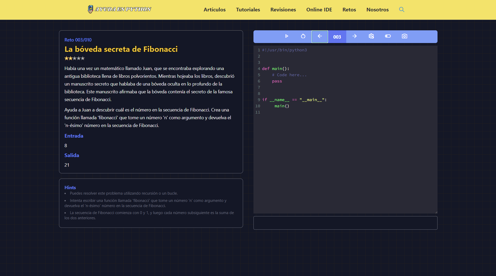

# Website de la comunidad AyudaEnPython

Se parte de nuestra comunidad [AyudaEnPython](https://www.facebook.com/groups/ayudapython),
nuestra finalidad es brindar apoyo a cualquier problema (principiante, intermedio, avanzado)
compartiendo información, conocimientos y experiencias relacionadas a Python.
@@ -15,4 +11,4 @@ este [enlace](https://github.com/AyudaEnPython/AyudaEnPython/blob/main/_aep/temp

## Guía de Contribuciones

Lee nuestra [guía](CONTRIBUTING.md) antes de empezar a contribuir.
